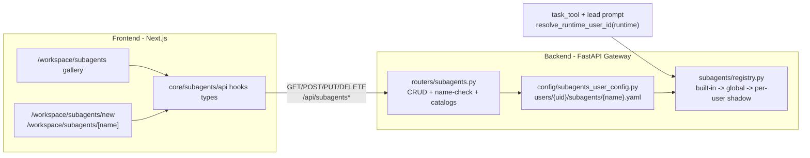

# Frontend Subagent Designer — Design Spec

- **Status:** Approved (brainstorming complete, pending implementation plan)
- **Date:** 2026-07-24
- **Topic:** A frontend designer for custom `SubagentConfig` types (the `task`-tool delegation targets)

## 1. Goal

Build a frontend UI in the DeerFlow Next.js app that lets a user **design and manage custom
subagent types**. A subagent type is the `subagent_type` argument the lead agent passes to
the `task` tool:

```python
task(description="...", prompt="...", subagent_type="deep-researcher")
```

Today custom subagent types are **file-only**: they live in `config.yaml`
(`subagents.custom_agents`) or YAML files dropped into a shared `subagents/` directory.
There is no CRUD API and no UI. This spec adds both.

### Non-goals (v1)

- No graph/chain editor (nodes + `depends_on` edges). The existing `/api/chains` router
  already supports chains; a graphical editor is a separate spec.
- No live "test/dry-run" panel that streams a subagent's response from the designer.
- The advanced `SubagentConfig` fields `disallowed_tools`, `exclusive_tools`, and
  `workflow` are **not** exposed as editable fields. They are preserved verbatim when
  present on an edited entry and applied with their defaults at runtime, but the UI does
  not surface them.
- Built-in subagents (`general-purpose`, `bash`) are never writable.

### Success criteria

1. A user can list, create, edit, and delete their own custom subagent types from the
   frontend.
2. A created/edited subagent type is immediately usable by the lead agent in a chat
   thread via the `task` tool, without a server restart or config reload.
3. Built-in and global custom subagents are visible read-only in the gallery; attempting
   to write to them fails with a clear error.
4. The designer validates all fields before save and offers live multi-selects populated
   from real backend catalogs (tools, skills, models).

## 2. Context & constraints

### Existing systems (do not regress)

- **Custom lead-agent personas** (`/workspace/agents`, `core/agents/`, backend
  `routers/agents.py` + `config/agents_config.py`) — the template to mirror. They persist
  **per-user** under `users/{user_id}/agents/{name}/` (config.yaml + SOUL.md) and expose a
  full CRUD API (`GET/POST/PUT/DELETE /api/agents[/{name}]` + name check).
- **Subagent types** (`subagents/config.py:SubagentConfig`, `subagents/registry.py`,
  `subagents/storage.py`) — the data model this feature operates on. `SubagentConfig` is a
  dataclass: `name, description, system_prompt, tools, disallowed_tools, exclusive_tools,
  skills, skills_on_demand, model, max_turns, timeout_seconds, workflow`. Resolution order
  today: built-ins → global config.yaml `subagents.custom_agents` → shared `subagents/`
  dir YAML files (dedup by name, custom over built-in).
- **Runtime user_id** (`runtime/user_context.py:resolve_runtime_user_id(runtime)`) reads
  `runtime.context["user_id"]` (set by gateway auth). This is the handle a tool uses to
  scope per-user state; the registry change threads it through.
- **Existing `task` tool** (`tools/builtins/task_tool.py`) resolves `subagent_type` via
  `get_subagent_config(...)`. The lead-agent prompt builder
  (`agents/lead_agent/prompt.py`) lists available names via `get_available_subagent_names`.

### Storage decision

**Per-user single YAML file** (chosen over dir+SOUL.md and DB-backed; see §9).

```
users/{user_id}/subagents/{name}.yaml
```

One file per design, holding all fields. Reuses the existing `parse_subagent_file`
parser. `disallowed_tools` defaults to `["task"]` and is **applied at registry build time,
not persisted** (the recursion guard is a runtime invariant, not an authored field).

### Format

```yaml
name: deep-researcher
description: "Specialized in multi-source research and synthesis."
system_prompt: |
  You are a research specialist...
tools: [web_search, read_file]      # None/omitted = inherit all
skills: [research-workflow]         # []/omitted = none loaded
skills_on_demand: [lit-review]      # optional
model: inherit                      # or a concrete model name from app_config.models
max_turns: 50
timeout_seconds: 900
```

## 3. Architecture



**Resolution / precedence (first match wins; built-in names are reserved):**

1. built-ins (`general-purpose`, `bash`) — names reserved; never overridden by a
   same-name per-user or global entry (validation rejects such names on create).
2. **per-user** `users/{uid}/subagents/{name}.yaml` — shadows a same-name **global**
   entry for that user only. This lets a user fork/customize an existing global type
   under the same name without touching admin config.
3. global config.yaml `subagents.custom_agents` / shared `subagents/` dir — base layer.

So per-user shadows global, and built-in stays on top (reserved). When `user_id=None`
(legacy/test path), the per-user layer is skipped and behaviour is unchanged.

### Data flow

- **Design path:** form → `core/subagents/api.ts` →
  `POST/PUT /api/subagents` → `subagents_user_config.py` writes the YAML file.
- **Picker catalogs:** on designer mount, `GET /api/subagents/catalogs` returns the
  available tools/skills/models so multi-selects only offer real options.
- **Runtime path:** inside a run, `task_tool` calls
  `get_subagent_config(subagent_type, user_id=resolve_runtime_user_id(runtime), app_config=...)`;
  the lead prompt builder calls
  `get_available_subagent_names(..., user_id=resolve_runtime_user_id(runtime))` so the LLM
  sees the user's custom types in the `task` tool description.

## 4. Backend

### 4.1 Storage module — `config/subagents_user_config.py` (new)

Mirrors `agents_config.py`'s file-level conventions; reuses the subagent YAML format.

Functions:

- `validate_subagent_name(name: str | None) -> str | None` — pattern `^[A-Za-z0-9-]+$`,
  rejects built-in names (`general-purpose`, `bash`).
- `resolve_subagent_dir(user_id: str) -> Path` — `users/{user_id}/subagents/`, mkdirs as
  needed.
- `list_user_subagents(user_id: str) -> list[SubagentConfig]` — scan dir, parse via
  existing `parse_subagent_file`, skip unreadable files.
- `list_user_subagent_names(user_id: str) -> list[str]` — names only (for registry name
  list).
- `load_user_subagent(name: str, user_id: str) -> SubagentConfig | None`
- `save_user_subagent(config: SubagentConfig, user_id: str)` — write YAML, omitting `None`
  fields the user didn't set; never writes `disallowed_tools` (registry applies the default).
- `delete_user_subagent(name: str, user_id: str) -> bool`

`disallowed_tools` is **not** persisted; it is applied by the registry during
`get_subagent_config` build (default `["task"]` for custom entries, same as built-ins).

### 4.2 Registry change — `subagents/registry.py` (additive)

Add optional `user_id: str | None = None` to `get_subagent_config` and
`get_subagent_names` (and `get_available_subagent_names`). New resolution tail:

```python
# In get_subagent_config: built-ins consulted first (names reserved);
# then per-user shadows a same-name global (consulted BEFORE the global custom lookup);
# then the existing global custom lookup (config.yaml custom_agents + shared files).
config = BUILTIN_SUBAGENTS.get(name)
if config is None and user_id is not None:
    config = load_user_subagent(name, user_id=user_id)   # per-user shadows global
if config is None:
    config = _build_custom_subagent_config(name, app_config)  # global
# existing config.yaml attribute-override pass applies on top of `config` as today.

# In get_subagent_names, build the ordered name list (built-in, then per-user, then
# global), dedup keeping the EARLIEST occurrence:
names = list(BUILTIN_SUBAGENTS.keys())
if user_id is not None:
    names += list_user_subagent_names(user_id=user_id)
names += list_subagent_names_global(app_config)   # existing global enumeration
# dedup: built-in wins, then per-user over global; one config per name.
```

The list builder yields one config per name; the first occurrence wins (built-in >
per-user > global), so a per-user entry shadows a same-name global in both single-lookup
and list views. `user_id=None` paths are byte-identical to current behaviour.

### 4.3 Runtime wiring (two additive call-site changes)

- `tools/builtins/task_tool.py`: pass
  `user_id=resolve_runtime_user_id(runtime)` into `get_subagent_config` and the
  `get_available_subagent_names` used to build the `task` tool description.
- `agents/lead_agent/prompt.py`: same `user_id` kwarg into
  `get_available_subagent_names` so the LLM's prompt lists the user's custom types.

No other call sites change. Legacy callers omitting `user_id` keep current behaviour.

### 4.4 API router — `gateway/routers/subagents.py` (new)

Mirrors `routers/agents.py`. Every route is `@require_permission(...)` with the effective
`user_id`. All storage writes go through this router (single writer).

| Method | Path | Purpose |
|---|---|---|
| GET | `/api/subagents` | List user's + built-in (+ visible global) subagents |
| GET | `/api/subagents/{name}` | Load one (built-in -> per-user -> global) |
| POST | `/api/subagents` | Create; validate name + fields; 409 if exists or built-in |
| PUT | `/api/subagents/{name}` | Update own; 404/403 if built-in/global |
| DELETE | `/api/subagents/{name}` | Delete own; 403 if built-in/global |
| GET | `/api/subagents/check?name=` | Name availability check |
| GET | `/api/subagents/catalogs` | Picker options: models, tools, skills |

**Response shape** (`SubagentResponse`):
`name, description, system_prompt, tools, skills, skills_on_demand, model, max_turns, timeout_seconds, readonly: bool, source: "builtin"|"global"|"user"`.

Built-in responses carry `readonly: true` and `source: "builtin"` so the UI renders them
non-editable. POST/PUT/DELETE on built-in (or non-self global) return 403.

**`GET /api/subagents/catalogs`** returns:

- `models`: `[{name, label}]` from `app_config.models`, prepended with
  `{name:"inherit", label:"Inherit parent"}`.
- `tools`: tool names from `deerflow.tools.get_available_tools()` (the same source the
  runtime uses to assemble a parent run's tools). These are the names a `config.tools`
  allowlist may reference.
- `skills`: installed skills `[{name, description}]` from the skills system (the same
  metadata the skills loader exposes for the lead agent's skill picker).

### 4.5 Validation (router)

- `name`: matches `^[A-Za-z0-9-]+$`, **not a built-in name** (`general-purpose`, `bash`),
  and **not already present in the user's own set** (POST → 409). A name that collides
  with a **global** entry is **allowed** (intentional per-user override); the API response
  surfaces a `overrides_global: true` hint so the UI can warn, but save proceeds.
- `description`: non-empty string.
- `model`: `"inherit"` or a name in `app_config.models`.
- `max_turns`: integer in [1, 500].
- `timeout_seconds`: integer in [60, 7200].
- `tools` / `skills` / `skills_on_demand` (when set): subsets of the respective catalog.

Validation failure → 422 with field-keyed errors. Storage write failure → 500 with logged
error (same pattern as `routers/agents.py`).

### 4.6 HTTP errors

- 404 — named subagent not found.
- 403 — write attempted on a restricted (built-in / non-self global) entry.
- 409 — name collision on create.
- 422 — validation failure.
- 500 — storage fault (logged).

## 5. Frontend

### 5.1 Routes & navigation

```diff
app/workspace/agents/        (existing lead-persona gallery)
+ app/workspace/subagents/
+   page.tsx                          # gallery
+   new/page.tsx                      # new designer
+   [name]/page.tsx                   # edit (read-only for built-in/global)
```

Sidebar (`components/workspace/workspace-nav-chat-list.tsx`): add a **Subagents** entry
below the existing **Agents** (`BotIcon` → `/workspace/agents`) using an icon like
`BoxesIcon`, linking to `/workspace/subagents`. New i18n key `sidebar.subagents`.

### 5.2 Core layer — `core/subagents/` (new)

Mirrors `core/agents/`:

- **`types.ts`** — `Subagent`, `SubagentCatalogs`, `SubagentNameCheck`,
  `CreateSubagentRequest`, `UpdateSubagentRequest`.
- **`api.ts`** — `listSubagents`, `getSubagent`, `createSubagent`, `updateSubagent`,
  `deleteSubagent`, `checkSubagentName`, `getSubagentCatalogs`. Target
  `${backendBaseURL()}/api/subagents*`. Mirror `core/agents/api.ts` error classes
  (`SubagentNameCheckError`, `SubagentsApiDisabledError`).
- **`hooks.ts`** — `useSubagents`, `useSubagent(name)`, `useCreateSubagent`,
  `useUpdateSubagent`, `useDeleteSubagent`, `useSubagentCatalogs`,
  `useCheckSubagentName` (debounced). TanStack Query keys: `["subagents"]`,
  `["subagents", name]`, `["subagent-catalogs"]`, `["subagent-check", name]`.
- **`index.ts`** — barrel exports.

### 5.3 Gallery — `components/workspace/subagents/`

- **`subagent-gallery.tsx`** — clones `agent-gallery.tsx` layout. `useSubagents` for data.
  Header "New subagent" button → `/workspace/subagents/new`. Built-in/global cards render
  read-only with a lock/badge, no destructive actions. User cards: edit + delete.
- **`subagent-card.tsx`** — clones `agent-card.tsx`. Shows name, type tag `[name]`
  (echoing the subtask-card prefix convention), description, source badge. Actions:
  edit (user source) → `/workspace/subagents/{name}`; delete (user source, confirm).
  Built-in/global: read-only, badge, no action buttons.

Note: subagent types are not standalone chat targets (they're invoked via `task`), so the
gallery cards have **no "chat" button** — unlike lead-persona cards which spawn chat
threads. This is the one deliberate visual divergence from `agent-card.tsx`.

### 5.4 Designer form

Shared `SubagentDesignerForm` component used by both `new/page.tsx` and
`[name]/page.tsx`.

| Field | Component | Source / validation |
|---|---|---|
| name | Input + live `checkSubagentName` | `^[A-Za-z0-9-]+$`, not built-in, backend-unique |
| description | Textarea | required; LLM-facing "when to delegate" guidance |
| system_prompt | Textarea (mono, large) | optional, recommended |
| model | Select | catalog options; "Inherit parent" first |
| tools | MultiSelect | catalog tools; empty = "inherit all" |
| skills | MultiSelect | catalog skills |
| skills_on_demand | MultiSelect (advanced, collapsed) | optional |
| max_turns | NumberInput | [1, 500] |
| timeout_seconds | NumberInput | [60, 7200] |

Advanced section (collapsed by default) hides `skills_on_demand` to reduce v1 clutter.
`disallowed_tools`, `exclusive_tools`, `workflow` are **not** surfaced; when editing an
existing global/legacy entry that carries them, the save round-trip preserves them
verbatim (backend keeps unknown fields when not supplied).

**Live YAML preview** — a read-only `<pre>` panel built from form state, showing the
file content that save would produce. Lightweight, no save dependency.

**Read-only mode** — when `[name]` loads a `readonly` source (built-in/global), form
renders non-editable with no save button. A "Clone" action pre-fills the form as a new
name (clone path → `/workspace/subagents/new?clone={name}`) so a user can fork a built-in
into their own custom type.

### 5.5 Submit flow

- Create → `POST` → invalidate `["subagents"]` → push `/workspace/subagents/{name}`.
- Edit → `PUT` → invalidate `["subagents"]` and `["subagents", name]`.
- Delete → confirm dialog → `DELETE` → invalidate → push `/workspace/subagents`.
- Network errors surface via `useNotification` (same pattern as lead-agent flow).

### 5.6 i18n

New `subagents` namespace in `en-US.ts` and `zh-CN.ts`: gallery title, new/edit/delete
buttons, field labels, placeholders, validation messages, read-only badge, advanced
toggle, sidebar label. Follow the existing flat-key structure.

## 6. Testing

### Backend (TDD mandatory; `backend/tests/`)

- `tests/unit/.../subagents/test_subagents_user_config.py` — save/load/list/delete,
  name validation (rejects built-ins), YAML round-trip, `disallowed_tools` not persisted.
- `tests/unit/.../subagents/test_registry_user_shadow.py` — per-user shadows global,
  global shadows built-in; `user_id=None` unchanged; name list merge + dedup.
- `tests/unit/.../routers/test_subagents.py` — CRUD happy paths, name check, catalogs,
  403 on built-in write, 404, 409, 422 validation, storage-fault 500.

### Frontend

- `tests/unit/core/subagents/api.test.ts` — fetch building with mocks (mirrors existing
  api test style).
- `subagent-designer-form.test.tsx` — validation + submit happy path / error path.
- E2E (`tests/e2e/`): optional gallery smoke test (mocked `/api/subagents`).

## 7. Alternatives considered

- **B: per-user dir + SOUL.md** — splits `system_prompt` into a sibling markdown file,
  matching lead-agents exactly. Rejected: diverges from the existing subagent single-YAML
  format and `parse_subagent_file`, adding a two-file format purely for precedent's sake.
  The editor's textarea already isolates the prompt field, so the split buys nothing.
- **C: DB-backed storage** — persist in SQLite. Rejected: config is natively file-based
  here (built-ins are code, global customs are YAML); a DB table adds migrations and a
  parallel load path bypassing the registry's layered resolution. Overkill.

## 8. Risks & mitigations

- **A user creates a per-user entry whose name collides with a global entry.**
  Mitigation: intentional — per-user shadows global for that user only (precedence in §3).
  The API returns `overrides_global: true` so the UI can warn before save; the
  `[name]` edit page shows the `source` badge so the user sees which entry they edit.
  Writes to a built-in name are rejected by validation (names reserved).
- **`task_tool` / lead-prompt user_id threading missed at a call site.** Mitigation: the
  change is the two call sites listed in §4.3, both grepped-and-listed; legacy callers
  omitting `user_id` keep current behaviour (kwarg optional with `None` default).
- **Catalog endpoint drift with existing model/skill/tool enumerations.** Mitigation:
  reuse the same backend sources the effort-config and skills systems already use rather
  than a parallel enumeration.

## 9. Out of scope / future

- Graph/chain editor (nodes → subagent types, edges → `depends_on`) — separate spec.
- Live test/dry-run panel streaming a subagent's response from the designer.
- Surfacing `disallowed_tools`, `exclusive_tools`, `workflow` as editable fields.
- Per-user → publish-to-global flow (admin-gated team sharing).