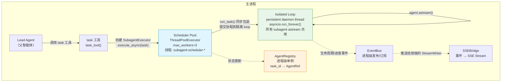
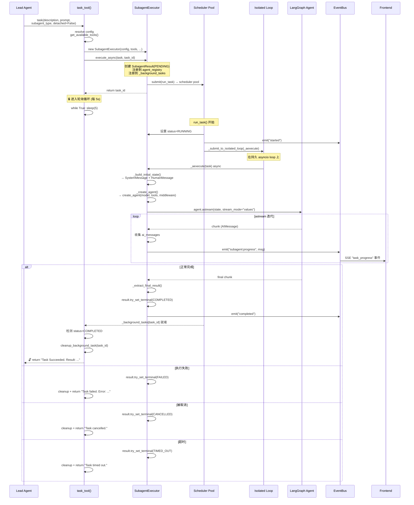
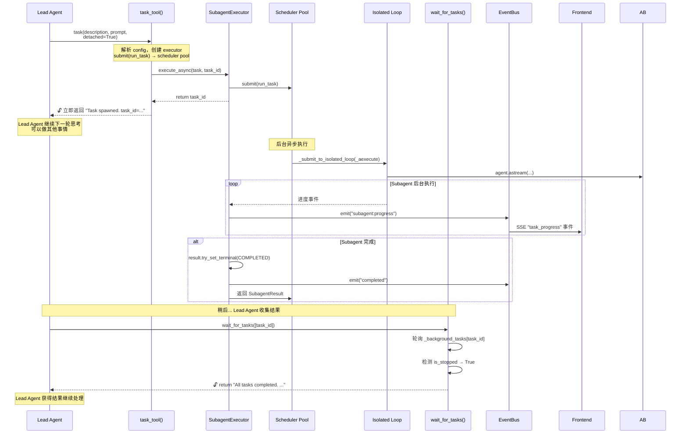
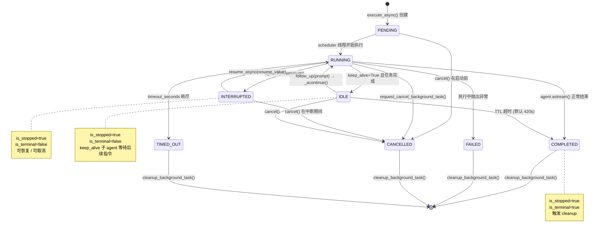
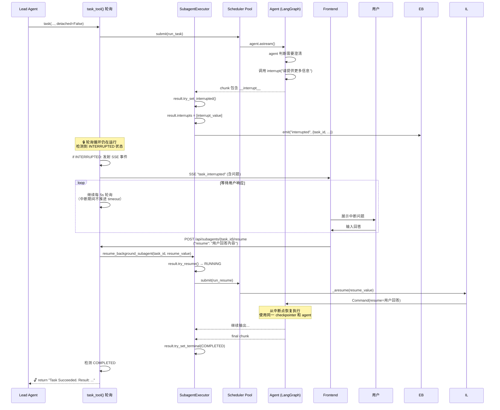
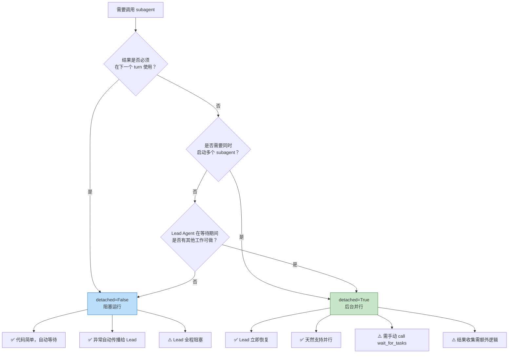
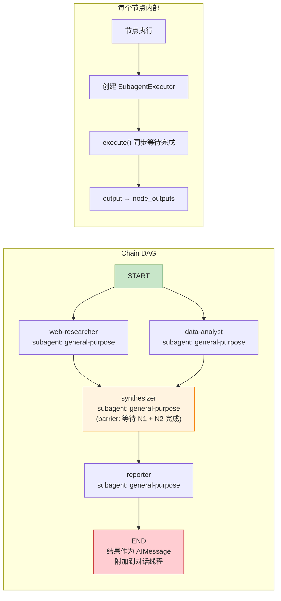

# 自定义 Subagent 与 Chain

## 自定义 Subagent

自定义 subagent 允许你为特定领域任务创建专用的子智能体。Subagent 接收父 agent 委托的任务，在隔离的上下文中执行，完成后返回结果。

### 创建自定义 Subagent

在 `subagents/custom/` 目录下创建一个 `.yaml` 或 `.yml` 文件：

```yaml
# subagents/custom/code-reviewer.yaml
name: code-reviewer
description: "代码审查专家，专注于发现代码缺陷、安全漏洞和性能问题"
system_prompt: |
  你是一个资深代码审查专家。审查代码时关注：
  - 安全漏洞（SQL注入、XSS、认证绕过等）
  - 性能瓶颈（N+1查询、内存泄漏、不必要的计算）
  - 代码规范和最佳实践
  - 可维护性和可读性

  审查完成后给出结构化的报告，按严重程度排列问题。

disallowed_tools:
  - task
  - ask_clarification
  - present_files

skills:
  - code-review    # 显式指定才加载；省略或设为 [] 则不加载任何 skill（全文注入上下文）

skills_on_demand:
  - web-search     # 仅在 prompt 中列出目录（name + description + 位置）；subagent 按需用 read_file 读 SKILL.md
  - pdf-export

model: inherit     # inherit 表示使用父 agent 的模型
max_turns: 80
timeout_seconds: 600
```

### 字段说明

| 字段 | 类型 | 必需 | 说明 |
|------|------|------|------|
| `name` | string | **是** | 唯一标识符，`task` 工具通过此名称调度 |
| `description` | string | **是** | 用自然语言描述何时应该委托给此 subagent（会出现在父 agent 的 system prompt 中） |
| `system_prompt` | string | 否 | 指导 subagent 行为的系统提示词 |
| `tools` | list | 否 | 工具白名单。`null`（默认）继承父 agent 的所有工具 |
| `disallowed_tools` | list | 否 | 工具黑名单。默认 `["task"]` 防止嵌套委托 |
| `exclusive_tools` | list | 否 | 额外的专属工具路径（如 `"deerflow.tools.custom:MyTool"`） |
| `skills` | list | 否 | Skill 白名单。`null` 或 `[]` 均不加载任何 skill；只在显式指定非空列表时才加载（全文注入上下文） |
| `skills_on_demand` | list | 否 | 按需加载的 Skill 名单。`null`/`[]` 均不列出。仅在 system prompt 中放目录条目（name + description + 容器路径），subagent 匹配到任务时用 `read_file` 读 SKILL.md，与 lead agent 的 progressive loading 一致。与 `skills` 互相独立，同一名字可同时出现在两者 |
| `model` | string | 否 | 模型名，`"inherit"`（默认）使用父 agent 的模型 |
| `max_turns` | int | 否 | 最大 agent turn 数，默认 50 |
| `timeout_seconds` | int | 否 | 超时秒数，默认 900 |
| `workflow` | string | 否 | 工作流工厂路径（见下方 workflow-subagent 章节） |

### 注册和覆盖

Subagent 的发现和配置覆盖共三层，优先级从高到低：

1. **config.yaml `subagents.agents.<name>`** — 对 built-in subagent 的运行时覆盖（timeout、max_turns、model、skills、skills_on_demand）
2. **config.yaml `subagents.custom_agents.<name>`** — 在配置文件中内联定义 subagent（优先级高于 YAML 文件）
3. **`subagents/{public,custom}/<name>.yaml`** — 文件系统中的 YAML 定义，`custom/` 目录覆盖 `public/` 目录

示例 — 在 `config.yaml` 中覆盖 built-in 和自定义 subagent 的配置：

```yaml
subagents:
  timeout_seconds: 1800       # 全局默认，仅对 built-in agent 生效
  max_turns: 150              # 全局默认，仅对 built-in agent 生效
  agents:
    general-purpose:
      timeout_seconds: 600    # 覆盖 general-purpose 的超时
      model: gpt-5            # 强制 general-purpose 使用指定模型
    code-reviewer:
      timeout_seconds: 1200
      skills: ["code-review"]
      skills_on_demand: ["web-search", "pdf-export"]   # 这些 skill 只列目录，按需 read_file 加载
```

### Skill 的加载方式：默认加载 vs 按需加载

Subagent 对 skill 有两种加载策略，对应两个字段：

- **`skills`（默认加载）**：被列出的 skill 的 `SKILL.md` 全文在 subagent 启动时直接注入 system prompt。适合 subagent 几乎每次任务都会用到的核心 skill。代价是每次委托都付出这些 skill 全文的 token。
- **`skills_on_demand`（按需加载）**：被列出的 skill 只在 system prompt 中放一个目录条目（name + description + 容器路径），subagent 判断任务匹配后用 `read_file` 工具按路径读取 `SKILL.md` 全文。与 lead agent 的 progressive loading 完全一致。适合想让 subagent「知道存在」但偶尔才用的 skill，避免每次委托都为冷门 skill 付全文 token。

两者互相独立：

- 一个 skill 名可以只出现在 `skills`、只出现在 `skills_on_demand`、或同时出现在两者（同时出现 = 全文注入且目录里也列着，冗余但不是错误）。
- `skills_on_demand` 中的 skill 若声明了 `allowed_tools`，这些工具在 subagent 启动时就可调用（policy 在装载前就生效），skill 内容则按需补充，避免会话中途工具可用性跳变。
- 描述质量很重要：按需加载依赖 subagent 从目录的 description 判断是否要读全文，description 写得差等于丢掉这个 skill。

> 注意：workflow-subagent 不使用 `skills` / `skills_on_demand` / `system_prompt` / `tools` 过滤，这些都由工作流自身控制。

### workflow-subagent（高级）

当通用 `create_agent` 模式不够用时，可以通过 `workflow` 字段引用一个自定义 LangGraph 工作流工厂：

```yaml
# subagents/custom/audit-agent.yaml
name: audit-agent
description: "合规审计子智能体，执行严格的多步审计流程"
workflow: "app.audit.workflow:build_audit_graph"
```

工作流工厂签名：

```python
# app/audit/workflow.py
from langgraph.graph import StateGraph
from deerflow.agents.thread_state import ThreadState

def build_graph(*, model, tools, config) -> StateGraph:
    graph = StateGraph(ThreadState)
    # ... 添加节点和边，返回未编译的 StateGraph
    return graph
```

注意：workflow-subagent 不使用 `system_prompt`、`skills`、`skills_on_demand` 和 `tools` 过滤 — 这些都由工作流自己完全控制。

### 可用的 built-in subagent

| 名称 | 描述 | 禁用工具 |
|------|------|----------|
| `general-purpose` | 通用子智能体，适合复杂的多步探索+操作任务 | `task`, `present_files` |

`task` 工具在非 workflow subagent 中默认禁用，防止无限嵌套委托。

---

## Chain

Chain 是一种声明式管道，将多个 subagent 按 DAG（有向无环图）编排执行。不同于由模型自主决策调用顺序的 `task` 工具，chain 的**执行顺序是硬编码的** — 由 YAML 中的 `depends_on` 字段定义。

> 💡 **TODO: 基于Langgraph的DAG是否是最终方案？对于需要循环、多智能体间协作、交互的场景是否需要考虑**


### Chain 的执行模型

- 每个节点运行一个 subagent 直到完成
- 没有 `depends_on` 的节点（根节点）从 `START` 并行启动
- 一个节点可以依赖多个上游节点（barrier/join — 所有依赖完成后才启动）
- 终端节点（没有其他节点依赖它）的结果会作为最终的 `AIMessage` 附加到对话线程

### 创建 Chain

在 `chains/custom/` 目录下创建一个 `.yaml` 文件：

```yaml
# chains/custom/research-report.yaml
description: "研究 → 分析 → 报告管道"

nodes:
  web-researcher:
    subagent: general-purpose
    depends_on: []
    prompt: |
      使用 web_search 工具研究以下主题，收集关键事实和来源，返回简洁的总结。

      主题: {input}

  data-analyst:
    subagent: general-purpose
    depends_on: []
    prompt: |
      查找和分析与以下主题相关的本地数据文件，返回你的发现。

      主题: {input}

  synthesizer:
    subagent: general-purpose
    depends_on: [web-researcher, data-analyst]
    prompt: |
      将以下两路研究结果综合成一个连贯的分析报告，解决冲突并突出最重要的洞察。

      网络研究:
      {node_outputs.web-researcher}

      数据分析:
      {node_outputs.data-analyst}

  reporter:
    subagent: general-purpose
    depends_on: [synthesizer]
    prompt: |
      基于以下分析，撰写一份清晰的中文最终报告给用户。

      分析结果:
      {node_outputs.synthesizer}
```

### 使用 Chain

在聊天中输入：

```
/chain:research-report 请研究2025年AI Agent的最新发展趋势
```

### Chain 字段说明

**顶层字段**

| 字段 | 类型 | 必需 | 说明 |
|------|------|------|------|
| `description` | string | **是** | Chain 的描述（用于自动补全和 API 展示） |
| `nodes` | object | **是** | 节点名 → `ChainNode` 的映射 |

**节点字段（ChainNode）**

| 字段 | 类型 | 必需 | 说明 |
|------|------|------|------|
| `subagent` | string | **是** | subagent 名称，引用 built-in 或在 registry 中注册的自定义 subagent |
| `depends_on` | list | 否 | 依赖的节点名列表。空列表或省略 = 根节点，可与其他根节点并行执行 |
| `prompt` | string | 否 | 提示词模板。支持 `{input}`（用户原始消息）和 `{node_outputs.<name>}` 占位符。省略时自动拼接上游输出 |

### Chain vs task 工具

| 特性 | Chain | task 工具 |
|------|-------|-----------|
| 执行顺序 | 声明式 DAG，硬编码 | 模型自主决策 |
| 并行 | 根节点自动并行 | 需要模型显式发起多个 task 调用 |
| 确定性 | 每次执行顺序一致 | 模型可自由选择顺序 |
| 适用场景 | 业务流程、标准管道 | 探索性任务、动态委托 |
| 触发方式 | `/chain:<name>` 前缀 | 模型自动调用 `task` 工具 |

---

## Subagent 运行模型：阻塞 vs 后台（Detached）

Subagent 支持两种运行模式，由 `task` 工具的 `detached` 参数控制。理解这两种模式的差异是正确使用 subagent 的关键。

### 整体架构：线程模型



> **为什么需要 Isolated Loop？** 使用一个长期存活的 asyncio loop 可以避免每次执行都创建新 loop，防止异步资源（如 HTTP session）在 loop 关闭时泄漏。Scheduler 线程是同步的，它通过 `asyncio.run_coroutine_threadsafe()` 将协程提交到这个隔离 loop。

---

### 模式一：阻塞运行（`detached=False`，默认）

Lead Agent 在 `task` 工具调用期间**被阻塞**，进入每 5 秒轮询一次的等待循环，直到 subagent 到达 stopped 状态才返回结果。



**关键特征**：
- Lead Agent **在整个 subagent 执行期间保持阻塞**，不能做其他事情
- 适用于必须等待结果才能继续的串行任务
- 前端通过 SSE 实时看到 subagent 的进度（`task_progress` 事件）
- 轮询间隔固定 5 秒，超时受 `timeout_seconds` 控制

---

### 模式二：后台运行（`detached=True`）

Lead Agent **立即恢复**，继续下一轮思考。Subagent 在后台异步执行，结果稍后通过 `wait_for_tasks()` 收集。



**关键特征**：
- Lead Agent **不会被阻塞**，可以同时发起多个 subagent
- 适用场景：并行探索、预取、不需要立即结果的任务
- 结果通过 `wait_for_tasks()` **集中收集**
- 也可以用 `follow_up(task_id, prompt)` 向已 IDLE 的 subagent 补充指令（配合 `keep_alive=True`）

---

### Subagent 状态生命周期

Subagent 在其生命周期中经历以下状态转换：



**状态分类**：

| 分类 | 状态 | 含义 |
|------|------|------|
| **活跃** | `PENDING`, `RUNNING` | Subagent 正在运行或等待启动 |
| **已停止，可恢复** | `INTERRUPTED`, `IDLE` | 暂停中，可被 resume/follow_up 唤醒 |
| **终态** | `COMPLETED`, `FAILED`, `CANCELLED`, `TIMED_OUT` | 不可恢复，触发 cleanup |

---

### 中断与恢复流程（人机协作 Route 甲）

当 subagent 调用 `interrupt()` 或 `ask_clarification` 时，进入人机交互路径：



**中断恢复的关键设计决策**：
- **轮询不停止**：INTERRUPTED 状态下轮询循环继续运行，只是不推进 timeout 倒计时
- **可重入**：恢复后的 subagent 可以再次调用 `interrupt()`，支持多轮人机对话
- **可取消**：中断期间仍然可以调用 `request_cancel_background_task()` 终止
- **Gateway 重启丢失**：中断状态存储在内存中，Gateway 重启后丢失（与所有工具调用状态一致）

---

### 阻塞 vs 后台：决策指南



---

### Subagent 到 Agent Registry 的完整生命周期映射

```mermaid
flowchart TB
    subgraph "启动阶段"
        A1["task 工具调用"] --> A2["SubagentExecutor 构造"]
        A2 --> A3["execute_async() 调用"]
        A3 --> A4["创建 SubagentResult<br/>status=PENDING"]
        A4 --> A5["agent_registry.register()<br/>key: task_id"]
        A5 --> A6["_background_tasks[task_id] = result"]
        A6 --> A7["_scheduler_pool.submit(run_task)"]
    end

    subgraph "运行阶段"
        B1["run_task() 在 scheduler 线程"] --> B2["status → RUNNING"]
        B2 --> B3["event_bus.emit('started')"]
        B3 --> B4["_submit_to_isolated_loop(_aexecute)"]
        B4 --> B5["_aexecute() 在 Isolated Loop"]
        B5 --> B6["agent.astream() 迭代"]
        B6 --> B7["每轮 emit('progress')"]
        B7 --> B8{"中断/完成/失败？"}
        B8 -->|interrupt()| B9["try_set_interrupted()"]
        B8 -->|完成| B10["try_set_terminal(COMPLETED)"]
        B8 -->|异常| B11["try_set_terminal(FAILED)"]
        B8 -->|超时| B12["try_set_terminal(TIMED_OUT)"]
    end

    subgraph "停止与清理"
        C1["task_tool poll loop 检测 is_stopped"] --> C2{"状态判断"}
        C2 -->|终态| C3["cleanup_background_task()"]
        C2 -->|INTERRUPTED| C4["发射 SSE 事件<br/>继续轮询"]
        C2 -->|IDLE| C5["返回结果<br/>保留 agent (不 cleanup)"]
        C3 --> C6["agent_registry.remove()"]
        C3 --> C7["del _background_tasks[task_id]"]
        C3 --> C8["del _subagent_executors[task_id]"]
        C3 --> C9["lifecycle_manager.dismiss()"]
        C3 --> C10["event_bus 解绑"]
    end

    A7 --> B1
    B9 -->|"POST resume"| B4
    B10 --> C1
    B11 --> C1
    B12 --> C1

    style A4 fill:#fff9c4,stroke:#f9a825
    style B2 fill:#e1f5fe,stroke:#0288d1
    style C3 fill:#ffcdd2,stroke:#c62828
```

---

### Chain DAG 执行流程

Chain 将多个 subagent 按 DAG 编排，声明式定义执行顺序：



**Chain 的关键行为**：
- 无 `depends_on` 的节点（根节点）从 `START` **并行** 启动
- 有 `depends_on` 的节点是所有上游节点完成后的 **barrier/join**
- 每个节点**阻塞执行**其 subagent（内部调用 `execute()`，非 `execute_async()`）
- 终端节点的结果拼接为最终的 `AIMessage`
